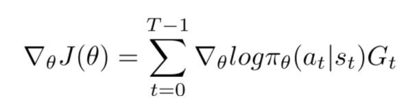

1) Take state input
2) Compute probs for actions state and take action acc to to those probs
3) Store the probs
4) Do the action choosen.
5) Store the reward after each action.
6) Repeat 1-5 until the episode ends
7) Calculate discounted rewards for each step in the trajectory
8) Compute grads

   where $$G_t$$ is the dsicounted rewards as a consequence of that actions