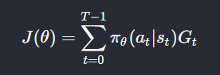
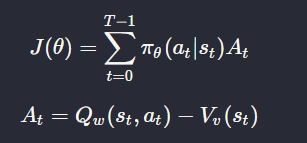
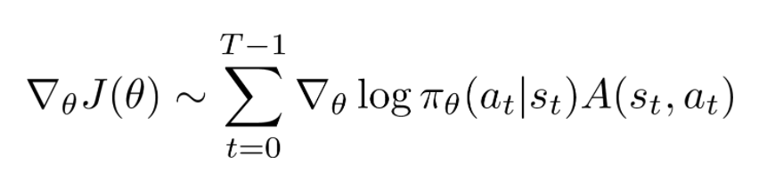

1) Take state input
2) Compute probs for actions state and take action acc to to those probs
3) Store the probs
4) Do the action choosen.
5) Store the reward after each action.
6) Repeat 1-5 until the episode ends
7) Calculate discounted rewards for each step in the trajectory
8) Compute grads

The Objective function is:

 

The grads can be derived from:

   where $$G_t$$ is the dsicounted rewards as a consequence of that actions
   
This was implementation of vanilla Policy Gradient now lets see A2C.
The full form is Advantage Actor Critic
In Vanilla implementation many times we take good actions and sometimes bad actions and those 2 cancel out each other and the agent doesnt learn whats actually **bad** and **good**.

So in A2C we introduce a Critic which tells how good was the action done in this particular step.
It basically is the difference between how much we **could** have get in this state and how much we actually got. It creates a difference between individula steps instead of whole trajectory.
This is the advantage part.

The changed Objective function is :

The grads will be:

Implementation:
- There will be 2 NNs one predicting the Q values of each state and then one predicting the State values of the current state.
- The function we want to maximize the Expected difference between the _predicted max reward from this state_ _, and the actual reward we get_.

Change the name of envoirment to try out different envoirments